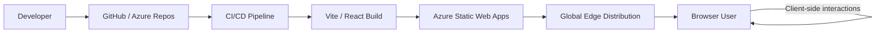
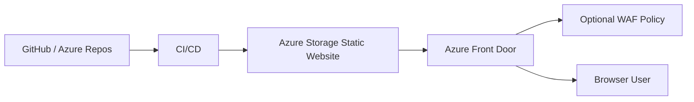
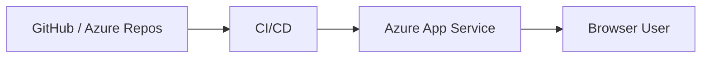
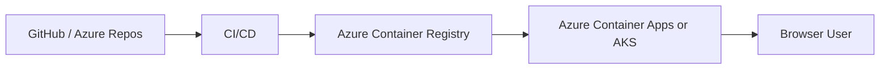
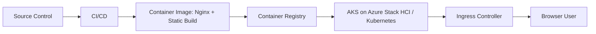
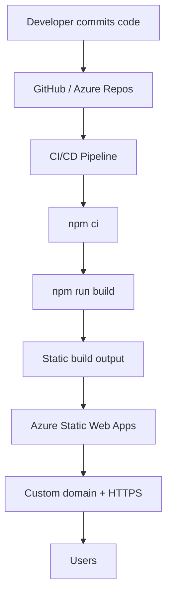
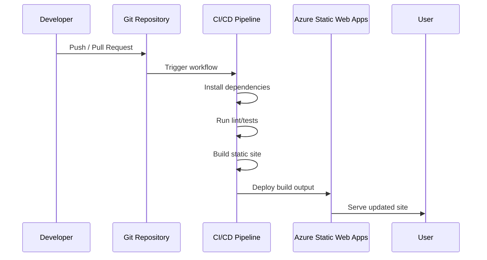
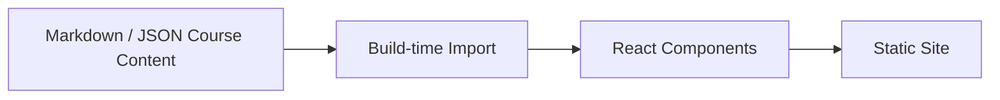
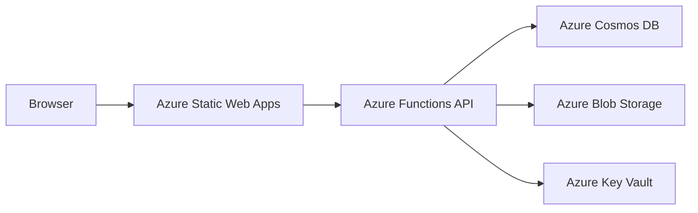

# Azure Architecture — Fiber Optics Course Website

This document defines the target Azure architecture for running the Fiber Optics Course Website. It is written as an implementation brief for a developer or AI coding assistant. It does **not** include the full application code.

## 1. Current Application Profile

The current app is a client-side React single-page application.

### Current characteristics

- React frontend.
- Tailwind-style utility classes.
- Client-side state for:
  - chapter navigation,
  - foldable sections,
  - tooltips,
  - quizzes,
  - final exam modal,
  - sliders and interactive visual labs.
- No server-side rendering.
- No database requirement in the current version.
- No authentication requirement in the current version.
- No user progress persistence in the current version.
- Routing currently works through hash routing.
- Course content is currently embedded in frontend data structures, but should eventually be externalized into structured content files.

### Implication

The app can be deployed as a static web application. A full backend is not needed for the current version.

---

## 2. Recommended Azure Target Architecture

## 2.1 Preferred architecture: Azure Static Web Apps

Use **Azure Static Web Apps** as the primary hosting option.

This is the best fit because the app is a static React SPA with no required backend. Azure Static Web Apps provides static hosting, global distribution, HTTPS, custom domains, and integrated CI/CD from GitHub or Azure DevOps.

### High-level architecture



### Azure resources

Minimum production resources:

| Layer | Azure Service | Purpose |
|---|---|---|
| Frontend hosting | Azure Static Web Apps | Hosts React build output |
| CI/CD | GitHub Actions or Azure Pipelines | Builds and deploys app |
| DNS | Azure DNS or existing DNS provider | Custom domain records |
| TLS | Static Web Apps managed cert | HTTPS for custom domain |
| Monitoring | Azure Monitor / Application Insights if needed | Availability and telemetry |
| Secrets | GitHub/Azure DevOps secrets | Deployment token or federated credentials |

### Why this is the preferred option

- Lowest operational overhead.
- No server management.
- Ideal for static React apps.
- Integrated CI/CD.
- Easy custom domain and HTTPS.
- SPA fallback can be configured cleanly.
- Can later add Azure Functions if dynamic backend features are needed.

---

## 3. Alternative Azure Hosting Options

## 3.1 Azure Storage Static Website + Azure Front Door

Use this option if you want more explicit control over CDN, caching, WAF, custom routing, or enterprise traffic management.



### Components

| Layer | Azure Service | Purpose |
|---|---|---|
| Static origin | Azure Storage static website | Stores built HTML/CSS/JS/assets |
| Edge routing | Azure Front Door | Global entry point, TLS, caching, routing |
| Security | Azure Front Door WAF | Optional web application firewall |
| DNS | Azure DNS or external DNS | Custom domain |
| Monitoring | Azure Monitor | Availability, logs, metrics |

### When to use

- You want enterprise-grade edge routing.
- You want WAF policies.
- You want custom caching rules.
- You want to later serve multiple static sites or apps behind one global endpoint.

### Caveat

Azure Storage static website hosting is simple, but SPA fallback behavior and security controls require more careful configuration, usually through Azure Front Door rules or application-side routing.

---

## 3.2 Azure App Service

Use Azure App Service only if you expect the site to become a Node/Express app, require server-side rendering, or need a traditional web app runtime.



### When to use

- You need server-side rendering.
- You need a Node backend hosted with the frontend.
- You need deployment slots for staging/production swaps.
- You want to run the app as a web server rather than static files.

### Caveat

For the current app, App Service is heavier than needed.

---

## 3.3 Containerized deployment on Azure Container Apps or AKS

Use this option if the course website becomes part of a larger containerized learning platform.



### When to use

- The frontend needs to be bundled with a backend.
- The app is part of a broader microservices platform.
- The organization standardizes around containers.
- You want parity with Azure Stack HCI / Kubernetes environments.

### Caveat

This is unnecessary complexity for the current static React app.

---

## 3.4 Azure Stack Hub / Azure Stack HCI option

If “Azure Stack” specifically means an on-premises or hybrid Azure Stack environment, the most portable architecture is a containerized static web server.



### Recommended approach for Azure Stack HCI / on-prem Kubernetes

- Build the React app into static files.
- Package build output into an Nginx container.
- Push the image to Azure Container Registry or a private registry.
- Deploy to Kubernetes / AKS on Azure Stack HCI.
- Use an ingress controller for routing and TLS.
- Configure fallback to `index.html` for SPA navigation if using path-based routing.

### When to use

- The environment is hybrid/on-prem.
- Public Azure Static Web Apps is not allowed.
- Enterprise policy requires workloads to run in a private datacenter.
- The course website will be bundled with internal training systems.

### Caveat

This requires more infrastructure responsibility than Azure Static Web Apps.

---

## 4. Recommended Architecture Decision

For the current app, choose:

> **Azure Static Web Apps for production hosting.**

Use the following architecture unless a specific enterprise requirement forces another option:



### Decision rationale

- The app is static and browser-driven.
- No backend is required.
- No database is required.
- Hosting should be simple and cheap.
- The app should be easy to deploy from source control.
- Future backend features can be added later without changing the frontend hosting model.

---

## 5. Application Repository Architecture

Recommended repository structure:

```text
fiber-course-website/
├─ README.md
├─ README_azure_architecture.md
├─ package.json
├─ vite.config.js
├─ index.html
├─ staticwebapp.config.json
├─ src/
│  ├─ main.jsx
│  ├─ App.jsx
│  ├─ styles.css
│  ├─ data/
│  │  ├─ chapters.js
│  │  ├─ glossary.js
│  │  ├─ quizzes.js
│  │  └─ finalExam.js
│  ├─ components/
│  │  ├─ layout/
│  │  ├─ chapter/
│  │  ├─ labs/
│  │  ├─ quizzes/
│  │  └─ ui/
│  └─ utils/
│     ├─ routing.js
│     └─ tooltipTerms.js
├─ public/
│  └─ assets/
└─ .github/
   └─ workflows/
      └─ azure-static-web-apps.yml
```

### Content architecture requirement

Course content should eventually be separated from layout code.

Recommended content modules:

| File | Purpose |
|---|---|
| `chapters.js` or `chapters.json` | Chapter titles, summaries, sections, body text |
| `glossary.js` | Tooltip definitions and definition points |
| `quizzes.js` | Chapter quiz banks |
| `finalExam.js` | Final exam question bank |
| `labs.js` | Mapping between chapter sections and learning lab types |

This keeps content maintainable and prevents the app component from becoming too large.

---

## 6. Build Configuration

The app should use a standard React build tool such as Vite.

### Recommended commands

```bash
npm ci
npm run build
```

Typical Vite output directory:

```text
dist/
```

### Static Web Apps build settings

| Setting | Value |
|---|---|
| App location | `/` |
| API location | empty / omitted |
| Output location | `dist` |
| Build command | `npm run build` |

If using Create React App instead of Vite, the output directory would usually be `build`.

---

## 7. SPA Routing Configuration

The current app uses hash routing, so deep-link fallback is less fragile.

If the app is later converted to path-based routing, add a Static Web Apps config file.

Recommended `staticwebapp.config.json`:

```json
{
  "navigationFallback": {
    "rewrite": "/index.html",
    "exclude": [
      "/assets/*.{png,jpg,jpeg,gif,svg,ico,webp,woff,woff2}",
      "/css/*.{css}",
      "/js/*.{js}",
      "/*.json"
    ]
  },
  "globalHeaders": {
    "X-Content-Type-Options": "nosniff",
    "Referrer-Policy": "strict-origin-when-cross-origin",
    "X-Frame-Options": "DENY"
  }
}
```

### Notes

- With hash routing, direct refresh issues are mostly avoided.
- With path routing, the platform must rewrite unknown routes to `index.html`.
- Static assets should be excluded from fallback rewrites.
- Security headers should be added at the edge where possible.

---

## 8. CI/CD Architecture

## 8.1 Preferred CI/CD

Use GitHub Actions or Azure Pipelines.



### Pipeline stages

1. Checkout source.
2. Install dependencies with `npm ci`.
3. Run static checks.
4. Run tests.
5. Build React app.
6. Deploy build output to Azure Static Web Apps.
7. Optional: run smoke test against deployed URL.

### Branch strategy

| Branch | Environment |
|---|---|
| `main` | Production |
| `develop` | Staging |
| Pull request branches | Preview environments, if enabled |

### Required checks

- Build must pass.
- No JSX/parser errors.
- Content tests pass.
- Final exam question count remains between 20 and 35.
- Chapter count remains exactly six.
- Chapter 4 remains stable unless intentionally changed.

---

## 9. Environment Strategy

Use at least two environments:

| Environment | Purpose |
|---|---|
| Staging | Validate design/content before production |
| Production | Public/stable course website |

Optional:

| Environment | Purpose |
|---|---|
| PR preview | Review UI/UX changes before merge |
| Content preview | Review content-only changes before release |

### Configuration separation

Environment-specific values should not be hard-coded. Use environment variables for future configuration such as:

- analytics keys,
- API endpoints,
- auth tenant/client IDs,
- feature flags.

For the current static app, very little environment configuration is needed.

---

## 10. Security Architecture

The current app is public and static, but basic security hygiene still matters.

### Required

- HTTPS only.
- Managed TLS certificate on custom domain.
- Security headers:
  - `X-Content-Type-Options: nosniff`
  - `Referrer-Policy: strict-origin-when-cross-origin`
  - `X-Frame-Options: DENY`
- No secrets in frontend source code.
- No API keys embedded in the static bundle.
- Dependency scanning in CI/CD.
- Protected production branch.

### Optional future security

If the course later needs accounts, progress tracking, admin editing, or private access:

| Need | Azure Service |
|---|---|
| User login | Microsoft Entra ID / Entra External ID |
| API auth | Azure Functions with Entra validation |
| Secrets | Azure Key Vault |
| Private admin area | Entra app roles or group-based access |
| WAF | Azure Front Door WAF |

---

## 11. Observability and Monitoring

The current app has no backend, so monitoring should focus on availability, frontend errors, and usage.

### Minimum

- Azure Static Web Apps deployment history.
- Browser console QA during release.
- Synthetic availability check for homepage and representative chapter routes.

### Recommended

- Application Insights JavaScript SDK for frontend telemetry.
- Azure Monitor availability tests.
- Basic dashboard:
  - page load failures,
  - JavaScript exceptions,
  - route usage,
  - quiz opens/completions,
  - final exam starts/completions.

### Future learning analytics

If user behavior matters later, capture events such as:

- chapter opened,
- section expanded,
- tooltip opened,
- check-yourself reasoning revealed,
- quiz completed,
- final exam submitted.

This should be implemented with privacy in mind and should not collect unnecessary personal data.

---

## 12. Performance Architecture

### Current performance risks

- Large single React component.
- Course content embedded directly in frontend bundle.
- Many SVG/interactivity blocks.
- Final exam and all chapters included in the initial JS bundle.

### Recommended optimizations

- Split content into separate data files.
- Use route-level code splitting.
- Lazy-load heavy chapter visual labs.
- Compress assets.
- Use static caching for hashed JS/CSS assets.
- Keep SVGs lightweight.
- Avoid external runtime dependencies where not needed.

### Caching

| Asset type | Cache recommendation |
|---|---|
| Hashed JS/CSS bundles | Long cache |
| `index.html` | Short/no cache |
| Images/SVG assets | Long cache if hashed |
| JSON content files | Moderate cache or versioned |

---

## 13. Data and Content Management Architecture

Current state: content is embedded in React code.

Recommended future state:



### Preferred content approach

- Store chapter content in Markdown or JSON.
- Store quizzes as structured JSON.
- Store glossary terms as structured JSON.
- Map each chapter section to a visual lab by ID.
- Render content through React components at build time.

### Why

- Easier editing.
- Cleaner codebase.
- Easier future migration to CMS.
- Easier translation/localization.
- Easier testing for missing visuals, missing key terms, or duplicated content.

### Optional future CMS

If non-developers need to edit content:

| Option | Use case |
|---|---|
| Git-based Markdown | Developer-friendly content workflow |
| Azure Blob Storage JSON | Lightweight remote content |
| Headless CMS | Non-technical editing |
| Cosmos DB | Dynamic content, user progress, personalization |

---

## 14. Future Backend Architecture

A backend is not required now. If needed later, use Azure Functions first.



### Possible backend features

| Feature | Suggested Azure Service |
|---|---|
| Save quiz/final exam results | Azure Functions + Cosmos DB |
| User accounts | Microsoft Entra ID |
| Admin content editing | Azure Functions + Cosmos DB / CMS |
| File uploads | Azure Blob Storage |
| Search content | Azure AI Search |
| Analytics | Application Insights |

---

## 15. Deployment Runbook — Azure Static Web Apps

### Step 1 — Prepare repository

Ensure the project has:

```text
package.json
index.html
src/
staticwebapp.config.json
```

Ensure scripts include:

```json
{
  "scripts": {
    "dev": "vite",
    "build": "vite build",
    "preview": "vite preview"
  }
}
```

### Step 2 — Create Azure Static Web App

Create a Static Web App in Azure.

Recommended settings:

| Setting | Value |
|---|---|
| Hosting plan | Free for test, Standard for production if needed |
| Source | GitHub or Azure DevOps |
| Build preset | React / Custom |
| App location | `/` |
| API location | empty |
| Output location | `dist` |

### Step 3 — Configure CI/CD

The platform can create a workflow automatically when connected to GitHub. Otherwise, manually create a pipeline with:

```bash
npm ci
npm run build
```

Deploy the generated `dist` folder.

### Step 4 — Configure custom domain

- Add custom domain in Static Web Apps.
- Configure DNS record.
- Enable managed certificate.
- Force HTTPS.

### Step 5 — Validate release

Smoke test:

- Homepage loads.
- All six chapters open.
- Opening a chapter starts at the top.
- Foldable sections work.
- Tooltips work once per term per section.
- Chapter quiz opens and shows feedback.
- Final exam opens in modal.
- Final exam navigation works.
- Final exam score/review works.
- Final exam custom scrollbar is visible.
- No console errors.

---

## 16. Infrastructure as Code

For production, define Azure resources using Bicep or Terraform.

Minimum IaC resources:

- Resource group.
- Static Web App.
- Optional Application Insights.
- Optional Azure DNS zone / custom domain records.
- Optional Front Door if using enterprise edge architecture.

### Recommended naming

```text
rg-fiber-course-prod
swa-fiber-course-prod
appi-fiber-course-prod
fd-fiber-course-prod
```

### Environment naming

```text
rg-fiber-course-dev
rg-fiber-course-stg
rg-fiber-course-prod
```

---

## 17. Cost Model

For the current version, expected cost is low.

### Lowest-cost architecture

- Azure Static Web Apps Free or Standard.
- Managed CI/CD.
- No database.
- No backend.
- No server.

### Costs may increase if adding

- Azure Front Door.
- WAF.
- Application Insights at high telemetry volume.
- Cosmos DB.
- Azure Functions at scale.
- Private networking.

---

## 18. Risks and Mitigations

| Risk | Mitigation |
|---|---|
| Blank screen after deploy | Verify root component import/export, build output, routing config, and console errors |
| SPA route refresh fails | Use hash routing or `navigationFallback` to `index.html` |
| Content hard to maintain | Externalize course content into structured data files |
| Large bundle | Code-split chapters and lazy-load labs |
| Browser default scrollbar breaks design | Keep custom scrollbar classes for exam modal scroll areas |
| Tooltips repeat too often | Enforce first occurrence per term per section |
| Quiz behavior regresses | Add tests for final exam flow and chapter quiz feedback |
| Chapter 4 accidentally changed | Add snapshot/content test or treat Chapter 4 as protected content |
| Secrets leaked to frontend | Never place secrets in static React env vars |

---

## 19. Acceptance Criteria for Azure Deployment

A deployment is accepted when:

- Site is reachable over HTTPS.
- Custom domain works if configured.
- Homepage loads without console errors.
- All six chapters are accessible.
- Browser refresh works on all supported routes.
- All interactive labs render.
- Foldable sections open and close.
- Tooltips render only once per term per section.
- Chapter quizzes work.
- Final exam modal works.
- Final exam navigator uses number/status list, not question text.
- Final exam custom scrollbar matches theme.
- Final exam review shows score, answers, correct answers, and feedback.
- Lighthouse performance and accessibility are acceptable for a content-heavy learning app.
- CI/CD deploys from the intended branch.
- Rollback procedure is documented.

---

## 20. Recommended Roadmap

### Phase 1 — Static production deployment

- Clean repository.
- Vite build.
- Azure Static Web Apps deployment.
- Custom domain.
- Basic smoke tests.

### Phase 2 — Maintainability

- Move content to structured files.
- Split components by domain.
- Add tests for content and quiz behavior.
- Add route-level lazy loading.

### Phase 3 — Observability

- Add Application Insights frontend telemetry.
- Track page loads and errors.
- Add availability checks.

### Phase 4 — Learning platform features

- Optional authentication.
- Optional progress tracking.
- Optional saved exam results.
- Optional admin content workflow.

### Phase 5 — Enterprise architecture

- Optional Azure Front Door.
- Optional WAF.
- Optional private/internal deployment.
- Optional containerized deployment for Azure Stack HCI or Kubernetes.

---

## 21. Source References

These references support the Azure architecture choices:

- Azure Static Web Apps documentation: https://learn.microsoft.com/en-us/azure/static-web-apps/
- Deploy a React app on Azure Static Web Apps: https://learn.microsoft.com/en-us/azure/static-web-apps/deploy-react
- Azure Static Web Apps configuration: https://learn.microsoft.com/en-us/azure/static-web-apps/configuration
- Azure Static Web Apps build configuration: https://learn.microsoft.com/en-us/azure/static-web-apps/build-configuration
- Deploy web frameworks to Azure Static Web Apps: https://learn.microsoft.com/en-us/azure/static-web-apps/deploy-web-framework
- Static website hosting in Azure Storage: https://learn.microsoft.com/en-us/azure/storage/blobs/storage-blob-static-website
- Azure static content hosting pattern: https://learn.microsoft.com/en-us/azure/architecture/patterns/static-content-hosting
- Azure App Service documentation: https://learn.microsoft.com/en-us/azure/app-service/
