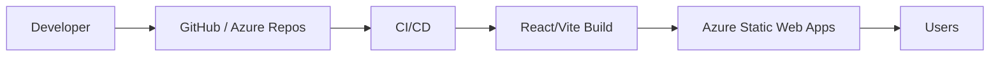
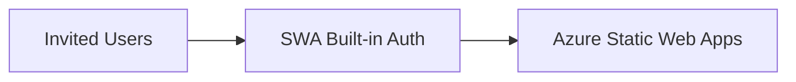
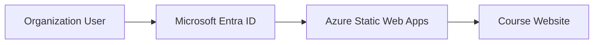
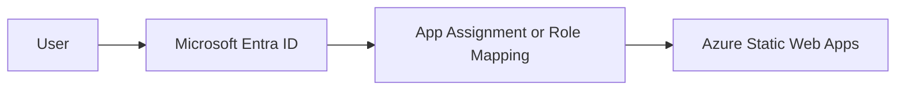
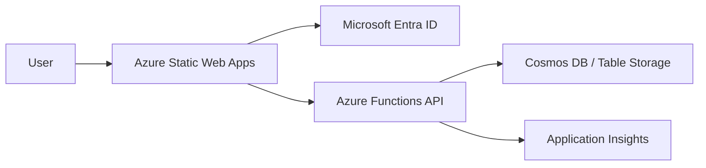
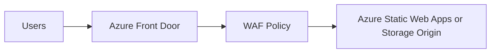
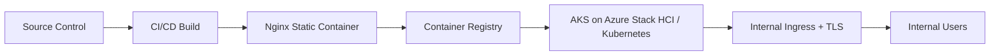

# Execution Plan — Deploy the Fiber Optics Course Website on Azure and Grant Access to Multiple Users

This document is a practical deployment and access plan for the Fiber Optics Course Website in its current form: a client-side React single-page application with interactive labs, chapter pages, quizzes, and a final exam modal.

The plan is organized from the simplest viable deployment to more complex enterprise scenarios. Each scenario balances implementation complexity against deployment quality: user access control, number of users, performance, durability, security, maintainability, and operational overhead.

---

## 1. Current App Assumption

The current app is a static React SPA.

### Current technical profile

- React frontend.
- Hash-based routing.
- No backend required.
- No database required.
- No user login required by the app itself yet.
- No persistent progress/results storage yet.
- Quizzes and final exam are client-side only.
- All course interaction happens in the browser.
- The app can be built into static assets and hosted as a static site.

### Deployment implication

The most efficient durable deployment is:

> **Azure Static Web Apps + CI/CD + optional Microsoft Entra authentication.**

A backend should only be added when the product needs persistent user progress, admin content management, analytics beyond frontend telemetry, or complex access control.

---

## 2. Deployment Quality Criteria

Use these criteria to choose the right scenario.

| Criterion | What it means |
|---|---|
| User access scale | How many people can realistically access the site |
| Access control | Whether access is public, invited, organization-only, group-based, or multi-tenant |
| Performance | Page load speed, global delivery, ability to handle many concurrent readers |
| Durability | Reliability of deployment, rollback, monitoring, and operational simplicity |
| Security | HTTPS, authentication, route protection, tenant restrictions, WAF if needed |
| Maintainability | Ease of editing content and improving the app without breaking it |
| Cost/complexity | Infrastructure cost and operational overhead |

---

## 3. Scenario Matrix — Simple to Complex

| Scenario | Best For | Access Model | User Scale | Performance | Complexity | Recommendation |
|---|---|---|---:|---|---|---|
| 1. Public static site | Open course, no private access | Anyone with URL | High, limited mainly by platform plan/bandwidth | Very good | Very low | Best first deployment if content can be public |
| 2. Private pilot cohort | Small invited group | SWA built-in auth + invitations | Small cohort; custom role invitations are limited | Very good | Low | Best for early testing with named users |
| 3. Organization-only training | Company/team internal course | Microsoft Entra ID tenant sign-in | Many users in one tenant | Very good | Medium | Best durable choice for internal access |
| 4. Specific groups / departments | Controlled internal rollout | Entra app assignment or group-based access | Many users, governed by Entra | Very good | Medium-high | Best for serious internal training |
| 5. Full learning platform | Saved progress, scores, admin content | Auth + API + database | Many users | Good, depends on backend | High | Use only when persistence is needed |
| 6. Enterprise edge/security | Public or private high-profile deployment | Front Door/WAF + SWA/Storage/App backend | High | Excellent edge/security | High | Use when WAF/global edge controls are required |
| 7. Hybrid / Azure Stack HCI | Private datacenter or hybrid requirement | Internal identity + containerized app | Depends on cluster | Depends on cluster | High | Use only if public Azure hosting is not allowed |

---

## 4. Recommended Practical Path

## Recommended path for this project

Use a staged approach:

1. **Phase 1 — Deploy fast and cleanly**
   - Azure Static Web Apps.
   - CI/CD from GitHub or Azure Repos.
   - Custom domain.
   - HTTPS.
   - Public access or basic authenticated access.

2. **Phase 2 — Add durable access control**
   - Microsoft Entra ID authentication.
   - Restrict route access to authenticated users.
   - For a company/team: restrict to a tenant and optionally require app assignment.

3. **Phase 3 — Add monitoring and release discipline**
   - Application Insights frontend telemetry.
   - Smoke tests.
   - PR preview environments.
   - Rollback by redeploying previous commit.

4. **Phase 4 — Add backend only if needed**
   - Azure Functions for APIs.
   - Cosmos DB or Table Storage for progress/scores.
   - Key Vault for secrets.
   - Entra roles/groups for admin/editor access.

---

## 5. Scenario 1 — Public Static Website

### Goal

Get the course online quickly and reliably for many users.

### Architecture



### Access model

- Anyone with the URL can access the course.
- No login.
- No user tracking.
- No private access control.

### User scale

- Suitable for many readers because the app is static.
- Practical limits are plan limits, bandwidth, asset size, and frontend performance.
- No backend bottleneck exists in this scenario.

### Performance quality

High.

Why:

- Static assets.
- Browser-side interactions.
- No server render delay.
- No database calls.
- No authentication round-trips.

### Complexity

Very low.

### Steps

1. Clean project into a standard Vite/React repo.
2. Run locally:
   ```bash
   npm ci
   npm run dev
   ```
3. Build:
   ```bash
   npm run build
   ```
4. Create Azure Static Web App.
5. Connect GitHub/Azure Repos.
6. Set:
   - App location: `/`
   - API location: empty
   - Output location: `dist`
7. Add custom domain.
8. Test all chapters, quizzes, final exam, and scrollbars.
9. Share the public URL.

### Pros

- Fastest route to production.
- Low cost.
- High performance.
- Minimal operations.
- Durable if CI/CD and custom domain are configured.

### Cons

- No private access.
- No user identity.
- No progress tracking.
- No ability to restrict content.

### Choose this if

The content can be public or access control does not matter yet.

---

## 6. Scenario 2 — Private Pilot Cohort with Built-In Static Web Apps Auth

### Goal

Grant access to a small number of named users for testing.

### Architecture



### Access model

- Use Azure Static Web Apps authentication.
- Protect the course routes so only authenticated users can access them.
- Invite users and assign roles.

### Important limitation

This is good for a small pilot. Static Web Apps role invitations have limits, so this should not be the long-term model for a large organization.

### Suggested route protection

Create `staticwebapp.config.json`:

```json
{
  "routes": [
    {
      "route": "/login",
      "redirect": "/.auth/login/aad"
    },
    {
      "route": "/logout",
      "redirect": "/.auth/logout"
    },
    {
      "route": "/*",
      "allowedRoles": ["authenticated"]
    }
  ],
  "responseOverrides": {
    "401": {
      "redirect": "/login",
      "statusCode": 302
    }
  },
  "navigationFallback": {
    "rewrite": "/index.html"
  },
  "globalHeaders": {
    "X-Content-Type-Options": "nosniff",
    "Referrer-Policy": "strict-origin-when-cross-origin",
    "X-Frame-Options": "DENY"
  }
}
```

### User scale

Small pilot group.

### Performance quality

High.

Authentication adds a sign-in step but the app is still static after access is granted.

### Complexity

Low.

### Steps

1. Upgrade to Static Web Apps Standard if needed for required auth/networking options.
2. Add `staticwebapp.config.json`.
3. Add login/logout links if desired.
4. Invite pilot users.
5. Assign them appropriate roles.
6. Test:
   - unauthenticated users get redirected,
   - authenticated users can access all chapters,
   - logout works,
   - deep links/hash routes still work.

### Pros

- Quick private pilot.
- No custom backend.
- Still very simple.
- Good for internal review.

### Cons

- Not ideal for many users.
- Role invitation management does not scale well.
- No progress tracking.

### Choose this if

You want 5–25 people to test privately before wider rollout.

---

## 7. Scenario 3 — Organization-Only Access with Microsoft Entra ID

### Goal

Grant access to many users inside one organization.

### Architecture



### Access model

- Users sign in with Microsoft Entra ID.
- Only users from the organization tenant can sign in.
- Optionally require users/groups to be assigned to the enterprise application.

### User scale

Good for many users in one organization.

### Performance quality

High.

After authentication, the website remains a static app. Performance is mostly determined by asset size, browser performance, and Azure Static Web Apps delivery.

### Complexity

Medium.

### Steps

1. Create/confirm Microsoft Entra tenant.
2. Create an app registration for the course site if using custom Entra provider.
3. Configure redirect URI:
   ```text
   https://<your-domain>/.auth/login/aad/callback
   ```
4. Configure Static Web Apps authentication.
5. Restrict all routes to authenticated users.
6. If the course should be limited to a specific group:
   - create an Entra group, for example `fiber-course-learners`,
   - assign that group to the enterprise application,
   - set the enterprise app to require assignment.
7. Test with:
   - assigned user,
   - unassigned user,
   - external Microsoft account,
   - admin account,
   - mobile browser.

### Pros

- Scales much better than invitation-based access.
- Durable for a company/team.
- Uses standard identity governance.
- No app-specific user database.

### Cons

- Requires Entra admin access.
- Group-based assignment may require Entra licensing depending on tenant setup.
- More configuration than a public site.

### Choose this if

The site is for an internal team, school, company, or training cohort managed through Microsoft Entra.

---

## 8. Scenario 4 — Specific Groups, Departments, or Role-Based Learning Paths

### Goal

Control access by group or role.

Examples:

- Only Data & AI team can access.
- Junior engineers see all chapters.
- Admins can see content preview.
- Trainers can access draft modules.

### Architecture



### Access model options

#### Option A — Entra app assignment

Use Entra enterprise application assignment.

- Assign individual users or groups to the app.
- Require assignment for sign-in.
- Best when the whole site has one access level.

#### Option B — Static Web Apps roles

Use Static Web Apps roles in `staticwebapp.config.json`.

- Good for route-level access.
- Simple for small role sets.
- Not a full learning-management authorization system.

#### Option C — Function-based role mapping

Use an Azure Function to map Entra group membership to Static Web Apps roles.

- More flexible.
- Better for group-driven roles.
- Higher complexity.
- Consider this if you need department-specific access or admin/editor roles.

### User scale

Good for many users if based on Entra groups/app assignment.

### Performance quality

High for static content; medium if role logic calls APIs on sign-in.

### Complexity

Medium-high.

### Pros

- Professional access governance.
- Works for large teams.
- Avoids manual invite management.
- Can support admin/trainer/student role separation.

### Cons

- More moving parts.
- Needs careful testing.
- Function-based role mapping adds backend complexity.

### Choose this if

You need controlled access beyond “everyone in the tenant can enter.”

---

## 9. Scenario 5 — Full Learning Platform with Progress and Exam Results

### Goal

Turn the site into a learning platform where users have saved progress and exam scores.

### Architecture



### Features added

- User profile.
- Chapter completion state.
- Saved quiz results.
- Saved final exam scores.
- Admin view of learner performance.
- Possibly content management.

### User scale

Good, but now backend capacity matters.

### Performance quality

Good if APIs are small and cached where appropriate. Static content remains fast, but progress and score actions depend on API/database performance.

### Complexity

High.

### Recommended Azure resources

| Requirement | Azure Service |
|---|---|
| Static frontend | Azure Static Web Apps |
| Auth | Microsoft Entra ID |
| APIs | Azure Functions |
| Data | Cosmos DB or Azure Table Storage |
| Secrets | Key Vault |
| Monitoring | Application Insights |
| CI/CD | GitHub Actions / Azure Pipelines |

### Data model sketch

```text
users
- userId
- displayName
- email
- tenantId
- createdAt

progress
- userId
- chapterRoute
- completedSections
- lastVisitedSection
- updatedAt

quizAttempts
- userId
- quizType
- chapterRoute
- answers
- score
- submittedAt
```

### Pros

- Real learning platform behavior.
- Durable learner progress.
- Useful for trainers/admins.
- Enables reporting.

### Cons

- Much more work.
- Security/privacy responsibilities increase.
- Need backend testing.
- Need data retention policy.

### Choose this if

You need proof of completion, saved results, or cohort management.

---

## 10. Scenario 6 — Enterprise Edge with Azure Front Door and WAF

### Goal

Improve global edge control, security posture, routing, and enterprise-grade traffic management.

### Architecture



### Access model

Can be combined with:

- public access,
- Static Web Apps auth,
- Entra auth,
- IP restrictions,
- WAF rules.

### User scale

High.

### Performance quality

Excellent when configured well.

### Complexity

High.

### When it is worth it

Use this if you need:

- WAF protection,
- custom edge rules,
- strict enterprise security,
- multiple environments/domains,
- centralized traffic management,
- advanced caching/routing,
- consolidated frontend for multiple apps.

### Important note

If Azure Front Door sits in front of Static Web Apps authentication, ensure forwarding gateway configuration and allowed forwarded hosts are set correctly so auth redirects use the right domain.

### Pros

- Strong edge security.
- More control over routing and caching.
- Better enterprise governance.

### Cons

- More configuration.
- More cost.
- More things to break around auth redirects and caching.
- Probably overkill for the first production deployment.

### Choose this if

You expect heavy public traffic, strict security review, or enterprise networking requirements.

---

## 11. Scenario 7 — Hybrid / Azure Stack HCI / Private Datacenter

### Goal

Run the app in an internal/private environment where public Azure hosting is not allowed.

### Architecture



### Access model

- Internal network access.
- Corporate SSO through reverse proxy or ingress auth.
- Optional Entra integration depending on environment.

### User scale

Depends on cluster and ingress capacity.

### Performance quality

Good if cluster and ingress are sized properly.

### Complexity

High.

### Steps

1. Build React app into `dist`.
2. Package `dist` into an Nginx container.
3. Push image to Azure Container Registry or internal registry.
4. Deploy to Kubernetes/Azure Stack HCI.
5. Configure ingress and TLS.
6. Configure SPA fallback to `index.html`.
7. Add SSO through ingress/reverse proxy if required.

### Pros

- Works in private/hybrid environments.
- Good if organization requires internal hosting.
- Portable across Kubernetes environments.

### Cons

- Unnecessary for the current app unless required by policy.
- Higher operational burden.
- You own more reliability and scaling work.

### Choose this if

The organization requires internal hosting or Azure Stack HCI specifically.

---

## 12. Concrete Recommended Execution Plan

## Week 1 — Production-ready static deployment

### Objective

Put the current site online with durable CI/CD and custom domain.

### Tasks

1. **Repository cleanup**
   - Ensure root component is exported correctly.
   - Ensure `src/main.jsx` imports the right component.
   - Ensure `index.html` points to the correct entry file.
   - Ensure build command works locally.

2. **Build verification**
   ```bash
   npm ci
   npm run build
   npm run preview
   ```

3. **Create Azure resources**
   - Resource group: `rg-fiber-course-prod`
   - Static Web App: `swa-fiber-course-prod`
   - Optional Application Insights: `appi-fiber-course-prod`

4. **Configure CI/CD**
   - GitHub Actions or Azure Pipelines.
   - Trigger on `main`.
   - Build output: `dist`.
   - Run basic tests before deploy.

5. **Configure custom domain**
   - Example: `fiber-course.yourdomain.com`
   - Enable HTTPS.

6. **Smoke test**
   - Homepage.
   - All six chapters.
   - Foldable sections.
   - Tooltips.
   - Final exam modal.
   - Custom exam scrollbar.
   - Mobile layout.
   - No console errors.

### Output

A production URL that can be shared.

---

## Week 2 — Controlled access

### Objective

Decide and implement the right access model.

### Decision

Use one of:

- Public URL if no restriction is needed.
- Private pilot if testing with a small group.
- Entra organization-only access if distributing to an internal team.

### Recommended for multiple users

If the course is for a company/team:

> Use **Static Web Apps Standard + Microsoft Entra ID + enterprise app assignment/group access**.

### Tasks

1. Add `staticwebapp.config.json`.
2. Configure authentication route.
3. Protect course routes.
4. Configure Entra app.
5. Restrict app to tenant.
6. Assign users/groups.
7. Test access with assigned and unassigned users.
8. Document onboarding/offboarding:
   - add user to group,
   - remove user from group,
   - verify access removed.

### Output

Multiple users can access through governed identity.

---

## Week 3 — Monitoring and release discipline

### Objective

Make the deployment durable.

### Tasks

1. Add Application Insights JavaScript SDK or equivalent frontend telemetry.
2. Track:
   - page load errors,
   - JavaScript exceptions,
   - chapter opens,
   - quiz starts,
   - final exam starts/submits.
3. Add availability test for homepage.
4. Add release checklist.
5. Add rollback procedure:
   - revert commit,
   - redeploy previous build,
   - validate smoke tests.
6. Add PR preview environments if using Static Web Apps.

### Output

The website is not just deployed; it is maintainable.

---

## Week 4+ — Platform evolution if needed

Only do this if the use case demands it.

### Add progress/results persistence

- Azure Functions API.
- Cosmos DB or Table Storage.
- Entra user identity as key.
- Save:
  - section progress,
  - quiz score,
  - final exam score.

### Add admin/trainer features

- Admin route.
- Admin role.
- Content preview mode.
- Cohort result dashboard.

### Add enterprise edge

- Azure Front Door.
- WAF.
- Custom routing/caching.
- Security review.

---

## 13. Access-Control Decision Tree

Use this to avoid overengineering.

```text
Do you need login?
│
├─ No
│  └─ Scenario 1: Public Azure Static Web App
│
└─ Yes
   │
   ├─ Is it just a small pilot?
   │  └─ Scenario 2: SWA auth + invitations
   │
   ├─ Is everyone in one organization/tenant?
   │  └─ Scenario 3: SWA + Microsoft Entra ID
   │
   ├─ Do only specific groups/departments get access?
   │  └─ Scenario 4: Entra app assignment or group-based roles
   │
   ├─ Do users need saved progress/scores?
   │  └─ Scenario 5: Add Azure Functions + database
   │
   └─ Is public Azure hosting not allowed?
      └─ Scenario 7: Containerized private/hybrid deployment
```

---

## 14. Performance Plan

### Immediate performance actions

- Keep app static.
- Keep hash routing or configure SPA fallback.
- Minify production build.
- Avoid loading unused libraries.
- Keep SVGs lightweight.
- Use lazy loading for heavy visual labs if bundle grows.
- Ensure assets are compressed by the hosting platform.
- Use long caching for hashed JS/CSS assets.
- Keep `index.html` short-cache to avoid stale deployments.

### When to scale beyond Static Web Apps alone

Consider Azure Front Door if:

- traffic becomes globally large,
- WAF is required,
- you need custom edge rules,
- you need centralized routing for multiple apps,
- security review demands edge-layer controls.

Consider backend scaling only if:

- users save progress,
- final exam results are stored,
- admin dashboards exist,
- content is fetched dynamically.

---

## 15. Durability Plan

### Required durability controls

- Source-controlled deployment.
- CI/CD pipeline.
- Main branch protection.
- Pull request review before production.
- Staging/preview environment.
- Smoke test checklist.
- Rollback procedure.
- Custom domain managed through DNS.
- Security headers.
- Monitoring.

### Rollback plan

1. Identify last known good commit.
2. Revert or redeploy previous commit.
3. Confirm Azure Static Web Apps deployment completes.
4. Smoke test:
   - homepage,
   - chapter page,
   - final exam modal,
   - auth if enabled.
5. Communicate restored status.

---

## 16. Quality Gates Before Production

Deployment is not accepted until all of these pass:

### App functionality

- Homepage loads.
- All six chapters open.
- Opening a chapter starts at the top.
- Foldable sections work.
- Tooltips appear once per term per section.
- Chapter quizzes open and show feedback.
- Final exam opens in modal.
- Final exam free navigation works.
- Final exam shows no feedback before submission.
- Final exam shows final score and full review after submission.
- Custom scrollbar is visible in final exam modal.
- Mobile layout is usable.

### Access

- Public scenario: URL works in incognito.
- Auth scenario:
  - unauthenticated users redirected to login,
  - authorized users can access,
  - unauthorized users cannot access,
  - logout works,
  - group/user assignment behaves as expected.

### Performance

- Production build loads without console errors.
- Initial page load acceptable on normal broadband.
- Interactions feel immediate.
- No backend dependency blocks the course in static mode.

### Operations

- CI/CD deploys from main branch.
- Preview/staging works.
- Rollback tested.
- Monitoring configured.
- Ownership documented.

---

## 17. Final Recommendation

For the current course website, the best balance of efficiency, durability, access control, and performance is:

> **Azure Static Web Apps Standard + Microsoft Entra ID authentication + Entra group/app assignment + CI/CD + custom domain + frontend monitoring.**

Use this if the course is meant for multiple controlled users inside an organization.

If access does not need to be restricted, use the simpler public Static Web Apps deployment first. Do not add Azure Functions, Cosmos DB, App Service, containers, or Azure Front Door until a real requirement forces that complexity.

---

## 18. References

- Azure Static Web Apps overview: https://learn.microsoft.com/en-us/azure/static-web-apps/overview
- Azure Static Web Apps quotas: https://learn.microsoft.com/en-us/azure/static-web-apps/quotas
- Azure Static Web Apps authentication and authorization: https://learn.microsoft.com/en-us/azure/static-web-apps/authentication-authorization
- Azure Static Web Apps custom authentication: https://learn.microsoft.com/en-us/azure/static-web-apps/authentication-custom
- Azure Static Web Apps configuration: https://learn.microsoft.com/en-us/azure/static-web-apps/configuration
- Restrict a Microsoft Entra app to a set of users: https://learn.microsoft.com/en-us/entra/identity-platform/howto-restrict-your-app-to-a-set-of-users
- Manage users and groups assignment to an application: https://learn.microsoft.com/en-us/entra/identity/enterprise-apps/assign-user-or-group-access-portal
- Azure Front Door documentation: https://learn.microsoft.com/en-us/azure/frontdoor/
- Azure App Service scale up/scale out: https://learn.microsoft.com/en-us/azure/app-service/manage-scale-up
- Azure Container Apps scaling: https://learn.microsoft.com/en-us/azure/container-apps/scale-app
